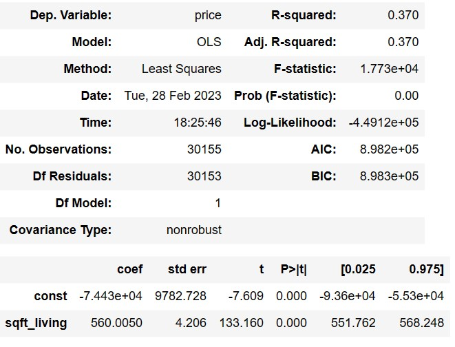

<h1 style="text-align: center;"> Kings County REIT Insights </h1>

#### Author: Tahron Herring

## Overview

 
A successful medium sized real estate investment trust is looking to grow its real estate portfolio by moving into the NorthWestern U.S. real estate market.  This project will use multiple linear regression modeling to analyze housing sales data from a NorthWestern county to provide insights for their undertaking.

## Business Understanding

 
Investing time, resources, and capitol into rehabing real estate is a heavy undertaking for any organization. Given the stakes of such an endevor our client needs to make the best posible decision when targeting homes for potential acquisition. I have been tasked with finding the housing features that most strongly influence housing price, and thus potential ROI, for the Kings County housing market. The REIT will use my findings to help influence which real estate assets they acquire and rehab.  

## Data Understanding

 
The Kings County housing sales dataset contains several features ranging from home price down thru to the year the home was renovated.  We can leverage these features in our regression model to try and predict home price.  We wil begin by analyzing and preparing our data for our model. Next we'll create a baseline model and improve on that model by adding variables to improve performace in subsequent models.  Lastly, we will present our results and recommendations for our client. 

## Regression Modeling

Now that the dataset has been transformed into a state where all variables can be utilized for regression analysis we can create our models. Our baseline model will be price vs the highest correlated variable and then we'll look to improve our model from that point.

### Model 1(Baseline): Price vs Living Space Square Footage

With a Adjusted R-squared score of 37% and a MAE score of 396,335 our baseline model is able to explain about 37% of the variance in Kings County home sales prices and is off by about $396,336 per house sale in a given perdiction. 

### Model 2: Price vs Living Space Square Footage, Number Of Bedrooms, Waterfront Status, House Grade, and View Rating

With an Adjusted R-squared score of 50% and a MAE score of 352,431 our first regression model is able to explain about 50% of the variance in Kings County home sales prices and is off by about $352,431 per house sale in a given perdiction. This iteration of our model is explaining the variance 13% better than our baseline and is predicting price by $43,905 better per home sale.  We'll try another iteration to improve model fit.

### Model 3: Price vs Living Space Square Footage, Number Of Bedrooms, Waterfront Status, House Grade, View Rating, and Year Built

With an Adjusted R-squared score of 51% and a MAE score of 338,354 our first regression model is able to explain about 51% of the variance in Kings County home sales prices and is off by about $338,354 per house sale in a given perdiction. This iteration of our model is explaining the variance 1% better than our first model and is predicting price by $14,077 better per home sale.

 

### Model 4(Final): Price vs Living Space Square Footage, Number Of Bedrooms, Waterfront Status, House Grade, View Rating, and Year Built

## Final Results & Recommendations

Regarding our final model, after removing all of the statistically insignificant coeficients the model drops in fitness. The Adjusted R-squared score is now 47% and the MAE score is 370,981.  We are able to explain about 47% of the variance in Kings County home sales prices and our predictions will be off by about $370,981 per house sale for a given perdiction. This iteration of our model is explaining the variance 4% worse than our second model and is predicting price by $32,627 worse per home sale.

After running four iterations of our regression model(1baseline, 3multiple linear regressions) I would recommend to our REIT client to focus their home acquisition strategy on the following metrics:
    
 - Square footage of living space : Where a larger square footage should result in larger sale prices
 - Number of bedrooms : Where more bedrooms should result in larger sale prices
 - Waterfront status : Where homes that are on a waterfront should result in larger sale prices 
 - Overall grade of the house : Where a grade rating of Excellent, Luxury, or Mansion should result in larger sale prices
 - View quality : Where a view quality of Fair, Excellent, or None should result in larger sale prices
 - Year house was built : Where a larger year(ie newer year) should result in larger sale prices

## Next Steps

This model needs to be improved to more accurately predict housing prices.  Some potential next steps aimed at improving model performace would be the following:

 - Find more variables, preferably ones that are linearly inclined that could help train the model better

 - Use more data points, more data points may help better train the model and it's predictions

 - Apply other modeling techniques, given that some of the variables may not be linear other methods may yeild better results
    
 - Apply different analysis techniques, we may need to break the dataset down into segments and analyze those segments individually as real estate can be a segmented market.

